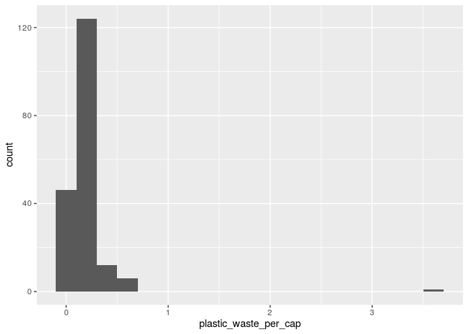
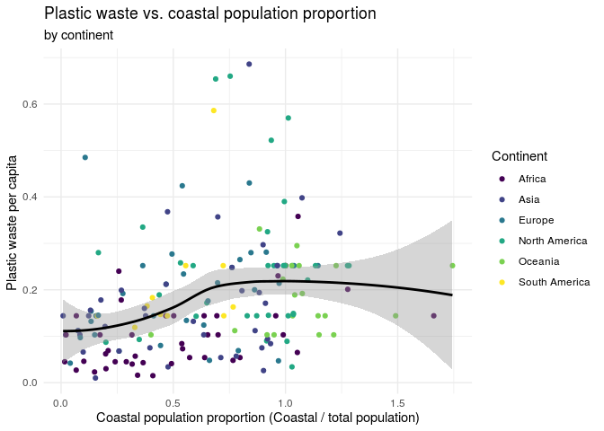

Lab 3 - Plastic Waste
================
DSC 200 - Data Science I
2021-02-16

Student Name:

Student ID:

``` r
library(tidyverse)
```

## Data

The dataset for this assignment can be found as a csv file in the `data`
folder of your repository. You can read it in using the following.

``` r
plastic_waste <- read_csv("data/plastic-waste.csv")
```

**Hint:** If you’re not sure, run the command `?NA` which will lead you
to the documentation.

-   Have a quick look at the data and notice that there are cells taking
    the value `NA` – what does this mean?

# Exercises

Let’s start by taking a look at the distribution of plastic waste per
capita in 2010.

``` r
ggplot(data = plastic_waste, aes(x = plastic_waste_per_cap)) +
  geom_histogram(binwidth = 0.2)
```

    ## Warning: Removed 51 rows containing non-finite values (stat_bin).

<!-- -->

One country stands out as an unusual observation at the top of the
distribution. One way of identifying this country is to filter the data
for countries where plastic waste per capita is greater than 3.5
kg/person.

``` r
plastic_waste %>%
  filter(plastic_waste_per_cap > 3.5)
```

    ## # A tibble: 1 x 10
    ##   code  entity continent  year gdp_per_cap plastic_waste_p… mismanaged_plas…
    ##   <chr> <chr>  <chr>     <dbl>       <dbl>            <dbl>            <dbl>
    ## 1 TTO   Trini… North Am…  2010      31261.              3.6             0.19
    ## # … with 3 more variables: mismanaged_plastic_waste <dbl>, coastal_pop <dbl>,
    ## #   total_pop <dbl>

Did you expect this result? You might consider doing some research on
Trinidad and Tobago to see why plastic waste per capita is so high
there, or whether this is a data error.

E1. Plot, using histograms, the distribution of plastic waste per capita
faceted by continent. What can you say about how the continents compare
to each other in terms of their plastic waste per capita?

``` r
ggplot(data = plastic_waste, 
      mapping = aes(x = plastic_waste_per_cap, 
                    color = continent, 
                    fill = continent)) +
   geom_histogram(alpha = 0.7)
```

**NOTE:** From this point onwards the plots and the output of the code
are not displayed in the lab instructions, but you can and should write
the code and view the results yourself.

Another way of visualizing numerical data is using density plots.

``` r
ggplot(data = plastic_waste, aes(x = plastic_waste_per_cap)) +
  geom_density()
```

And compare distributions across continents by colouring density curves
by continent.

``` r
ggplot(data = plastic_waste, 
       mapping = aes(x = plastic_waste_per_cap, 
                     color = continent)) +
  geom_density()
```

The resulting plot may be a little difficult to read, so let’s also fill
the curves in with colours as well.

``` r
ggplot(data = plastic_waste, 
       mapping = aes(x = plastic_waste_per_cap, 
                     color = continent, 
                     fill = continent)) +
  geom_density()
```

``` r
ggplot(data = plastic_waste, 
       mapping = aes(x = plastic_waste_per_cap, 
                     color = continent, 
                     fill = continent)) +
  geom_density(alpha = 0.7)
```

This still doesn’t look great…

E2. Recreate the density plots above using a different (lower) alpha
level that works better for displaying the density curves for all
continents.

E3. Describe why we defined the `color` and `fill` of the curves by
mapping aesthetics of the plot but we defined the `alpha` level as a
characteristic of the plotting geom.

Answer here:

*Now is a good time to knit your document and commit and push your
changes to GitHub with an appropriate commit message. Make sure to
commit and push all changed files so that your Git pane is cleared up
afterwards.*

And yet another way to visualize this relationship is using side-by-side
box plots.

``` r
ggplot(data = plastic_waste, 
       mapping = aes(x = continent, 
                     y = plastic_waste_per_cap)) +
  geom_boxplot()
```

E4. Convert your side-by-side box plots from the previous task to
[violin plots](http://ggplot2.tidyverse.org/reference/geom_violin.html).
What do the violin plots reveal that box plots do not? What features are
apparent in the box plots but not in the violin plots?

**Remember:** We use `geom_point()` to make scatterplots.

E5. Visualize the relationship between plastic waste per capita and
mismanaged plastic waste per capita using a scatterplot. Describe the
relationship.

E6. Colour the points in the scatterplot by continent. Does there seem
to be any clear distinctions between continents with respect to how
plastic waste per capita and mismanaged plastic waste per capita are
associated?

E7. Visualize the relationship between plastic waste per capita and
total population as well as plastic waste per capita and coastal
population. You will need to make two separate plots. Do either of these
pairs of variables appear to be more strongly linearly associated?

*Now is another good time to knit your document and commit and push your
changes to GitHub with an appropriate commit message. Make sure to
commit and push all changed files so that your Git pane is cleared up
afterwards.*

# Wrapping up

If you haven’t had time to finish the exercises above, please ask for
help before you leave!

**Hint:** The x-axis is a calculated variable. One country with plastic
waste per capita over 3 kg/day has been filtered out. And the data are
not only represented with points on the plot but also a smooth curve.
The term “smooth” should help you [pick which geom to
use](https://ggplot2.tidyverse.org/reference/index.html#section-geoms).

E8. Recreate the following plot, and interpret what you see in context
of the data.

<!-- -->

Knit, *commit (with an appropriate message), and push your changes to
GitHub with an appropriate commit message. Make sure to commit and push
all changed files so that your Git pane is cleared up afterwards and
review the md document on GitHub to make sure you’re happy with the
final state of your work.*

Lab material sourced from <https://datasciencebox.org/>
